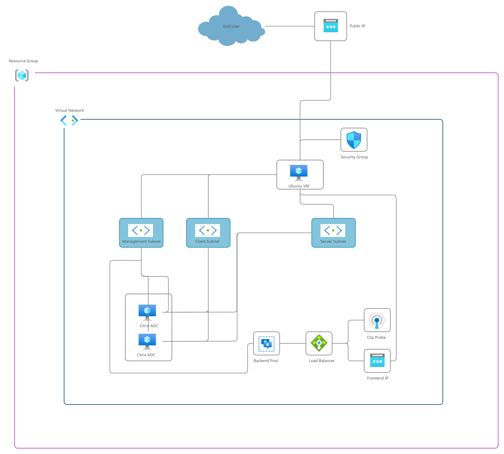

# Automating Citrix ADC Cluster - for CUSTOMERNAME
- [Pre-requisities](#pre-requisities)
- [Folder Structure](#folder-structure)
  * [Terraform related files](#terraform-related-files)
  * [Python script related files](#python-script-related-files)
  * [Shell script related files](#shell-script-related-files)
- [Authentication options](#Authentication-options)
- [Topology](#topology)
- [Input File `input.auto.tfvars`](#input-file-inputautotfvars)
- [Assumptions](#assumptions)
- [What does the Solution do](#what-does-the-solution-do)
  * [Role of Terraform tool](#role-of-terraform-tool)
  * [Role of `cluster.py` script](#role-of-clusterpy-script)
  * [Role of `get_num_nodes.sh` script](#role-of-get_num_nodessh-script)
- [Procedure to run the cluster bringup script](#procedure-to-run-the-cluster-bringup-script)

The below documentation provides an overview on the provisioning of Citrix ADC clustering using Terraform tool

## Pre-requisities
1. Terraform v.12.0+
2. Azure CLI if not using service principle
3. python3

## Folder Structure
### Terraform related files
1. `input.auto.tfvars` - user input file to Terraform
2. `main.tf` - all Terraform resources are present here
3. `variables.tf` - all Terraform variables are declared here
4. `outputs.tf` - all Terraform output variables are declared here

### Python script related files
1. `cluster.py` - used to create and manage cluster. This file will be internally called by Terraform

### Shell script related files
1. `get_num_nodes.sh` - It gets the current number of nodes present in the cluster.  
    EX- ./get_num_nodes.sh prefix(defined in input.auto.tfvars)
    
## Authentication options
- For logging into the azure cloud two options have been provided in the script:
  * The first method is to authenticate via Azure CLI. Run the following command and then follow along to sign into azure:  
    az login 
    Once logged in, terraform can deploy resources using that account.
  * If role permits, one can create a service principle and provide the logging credentials info in the input.auto.tfvars file.
    
## Topology

## Input File `input.auto.tfvars`

// logging credentials, use logging credentials if want to login using service principle

// **`tenant_id`**                       = ""

// **`subscription_id`**                 = ""

// **`client_id`**                       = ""

// **`client_secret`**                   = ""

// Other variables used in code

**`prefix`**                          = ""

**`location`**                        = "West US 2"

**`vpc_cidr_block`**                  = "10.0.0.0/16"

**`management_subnet_address_space`**    = "10.0.1.0/24"

**`client_subnet_address_space`**        = "10.0.2.0/24"

**`server_subnet_address_space`**        = "10.0.3.0/24"

**`nodes_password`**                  = ""

**`cluster_tunnelmode`**              = "UDP"

**`cluster_backplane`**               = "0/1"

**`private_key_path`**                = "~/.ssh/id_rsa"

**`public_key_path`**                 = "~/.ssh/id_rsa.pub"

## Assumptions
1. The automation handles only 1 cluster for now
2. All added nodes will go to `state=ACTIVE` by default
3. Addition of nodes will take place **serially**

## What does the Solution do
There are two components involved.
- `Terraform` Tool - which creates the *infrastructure* such as Resource Group, VNet, subnets, required number of CitrixADCs (nodes)
- `cluster.py` script which helps in managing (add/update/delete) the cluster nodes. 

### Role of Terraform tool
- Creates a Resource Group - `Terraform Resource Group`
- Creates a VNet - `Terraform VNet`
- Creates 3 subnets - `management`, `client`, `server`
- Creates a security group for ubuntu to allow end users access to it possible through ssh.
- Creates ubuntu - `test_ubuntu` - used kind of jumpBox to run `cluster.py` script
- 1 Public IP - for `test_ubuntu`'s client-side
- 3 NICs for each CitrixADC - `management`, `server`, `client`
- 3 NICs for test_ubuntu - `ubuntu_client`, `ubuntu_management`, `ubuntu_server`
- Creates a Load Balancer - `Terraform Load Balancer with following components`
  * Frontend ip which is used as clip
  * Backend pool containing mangement ips of all citrix adc nodes in the cluster
  * Clip probe sent on 9000 tcp port to which only cco node in the cluster replies.
  * Load balancong rule to specify what traffic to allow and how is it distributed as in the source and destination port mapping.
> Terraform copies `cluster.py` to `ubuntu` (acts as jumpBox) and executes it remotely, by passing required arguments.

### Role of `cluster.py` script
- Depending on the arguments, this script adds/updates/deletes the required number of nodes to/from the cluster.
-  It configures citrix adc nodes to form a cluster using Nitro API calls.

### Role of `get_num_nodes.sh` script
- Returns the total number of nodes in the cluster.
- To run the script -   
 ./get_num_nodes.sh prefix
- Here prefix is the variable defined in input.auto.tfvars file.

## Procedure to run the cluster bringup script
1. For authentication use one of the methods-
   - Azure CLI - run az login command in the terminal and then follow along to log into azure
   - Service Principle - To use this method for authentication follow the following steps - 
     * Create a service principle in azure and get the following values - tenant_id, subscription_id, client_id and client_secret.
     * Paste these values in the respective variables in input.auto.tfvars file uncommenting them.
     * Uncomment the above variables in variables.tf file as well.
     * In main.tf file uncomment the azurerm block with these variables and comment the empty one.
2. When running terraform first time in a directory, initialize terraform using the following command - 
  - terraform init
3. For every run use the following commands -
  - terraform plan
  - terraform apply
4. teraform plan shows the changes that the terraform tool will make and terraform apply commits those changes.
